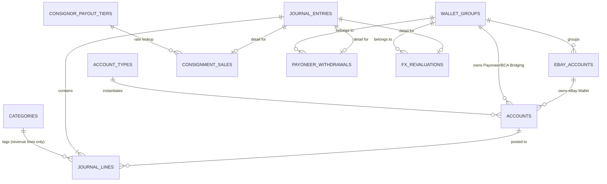

# Database Schema — Milestone 2 Proposal

Scope check against `CLAUDE.md`'s Build milestones: milestone 2 is "Postgres schema + chart of accounts + double-entry posting engine + the business rules that have money implications... verified against hand-crafted test transactions and unit tests only. No eBay API, no Google Drive, no OCR, no web UI, no review queue yet." This doc proposes only what that milestone needs. Review Queue, Invoices, and Documents-ingestion tables belong to milestone 3 — they're previewed briefly at the end so you can see how this schema extends, but they are **not** part of what Builder would implement now.

This is a design-review step, same spirit as the UI/UX pass: you see the shape before Builder writes a line of code against it.

## Design principles

- **Standard double-entry ledger shape**: a `journal_entries` header table + a `journal_lines` detail table. Every posting is one header row and two-or-more line rows whose debits and credits balance. This is the one structural decision everything else hangs off of.
- **Money is `NUMERIC`, never float.** IDR amounts use `NUMERIC(20,2)`, USD reference amounts use `NUMERIC(14,2)`.
- **IDR is the ledger currency** (per CLAUDE.md — "IDR is the single source of truth for all statements"); USD is carried as a nullable reference field alongside it, never a parallel ledger.
- **Traceability by construction, not by convention.** Anything CLAUDE.md says must be traceable (COGS → invoice, consignment payout → tier calculation, FX gain/loss → the actual Payoneer withdrawal figures) gets its own small detail table pointing back to `journal_entries`, rather than relying on a memo string. A report drill-down is then just "find the journal lines for this account/period" plus a join to the relevant detail table.
- **The wallet-group/eBay-account distinction is a first-class relationship**, not a naming convention — this was the single biggest structural fact to get right after the 2026-08-31 correction (2 of 3 eBay accounts share one Payoneer wallet + BCA bridging account).
- **Every table that can plausibly need one keeps a nullable "reference" field for something not yet built** (consignor/item ref, category tag) — these were explicitly called out in CLAUDE.md as "preserved for traceability, not used for rollups yet."

## Entity-relationship diagram

## Core tables

### `wallet_groups`
The entity a Payoneer Wallet and BCA Bridging Account actually belong to — introduced specifically because two of the three eBay accounts share one wallet-group and one has its own (see Business model in CLAUDE.md).

| Column | Type | Notes |
|---|---|---|
| `id` | `BIGSERIAL PK` | |
| `name` | `TEXT` | e.g. "Wallet Group 1 (shared)", "Wallet Group 2 (independent)" |
| `created_at` | `TIMESTAMPTZ` | |

### `ebay_accounts`
| Column | Type | Notes |
|---|---|---|
| `id` | `BIGSERIAL PK` | |
| `name` | `TEXT` | e.g. "Account 1" |
| `wallet_group_id` | `BIGINT FK → wallet_groups` | Many eBay accounts → one wallet-group. **Never** a 1:1 assumption. |
| `ebay_seller_username` | `TEXT` | For matching against export data (e.g. "ricky.game" from the sample CSV) |
| `is_active` | `BOOLEAN` | Lets the other 2 accounts exist as rows before they're "live" |
| `created_at` | `TIMESTAMPTZ` | |

### `account_types`
The abstract Chart-of-Accounts line items from CLAUDE.md — one row per line in that list (eBay Wallet, Payoneer Wallet, Sales Revenue, Consignor Payable, etc.), independent of how many times it's instantiated.

| Column | Type | Notes |
|---|---|---|
| `id` | `BIGSERIAL PK` | |
| `code` | `TEXT UNIQUE` | e.g. `EBAY_WALLET`, `PAYONEER_WALLET`, `SALES_REVENUE` |
| `name` | `TEXT` | Display name, matches CLAUDE.md's Chart of accounts wording exactly |
| `statement_section` | `TEXT` | `asset` / `liability` / `equity` / `revenue` / `cogs` / `opex` / `other_income_expense` — drives which statement it rolls into |
| `normal_balance` | `TEXT` | `debit` or `credit` |
| `scope_kind` | `TEXT` | `per_ebay_account` / `per_wallet_group` / `consolidated` — determines how many rows of `accounts` this type gets instantiated into |
| `is_contra` | `BOOLEAN` | `true` only for Sales Returns & Allowances |

### `accounts`
The actual ledger accounts money posts to — the instantiated rows. This is what makes "3 eBay Wallets, but only 2 Payoneer Wallets and 2 BCA Bridging Accounts" a real, queryable fact instead of something Builder has to remember.

| Column | Type | Notes |
|---|---|---|
| `id` | `BIGSERIAL PK` | |
| `account_type_id` | `BIGINT FK → account_types` | |
| `ebay_account_id` | `BIGINT FK → ebay_accounts, NULLABLE` | Set only when `account_types.scope_kind = 'per_ebay_account'` |
| `wallet_group_id` | `BIGINT FK → wallet_groups, NULLABLE` | Set only when `scope_kind = 'per_wallet_group'` |
| `currency` | `TEXT` | `USD` for wallets, `IDR` for everything else |
| `created_at` | `TIMESTAMPTZ` | |

Constraint: exactly one of `ebay_account_id` / `wallet_group_id` is non-null when the type calls for it; both null for `consolidated` types. A unique index on `(account_type_id, ebay_account_id)` and `(account_type_id, wallet_group_id)` (partial indexes, Postgres supports this) stops an accidental duplicate wallet from ever being created.

### `categories`
The revenue-analytics tag — explicitly **not** a P&L dimension (see Category tagging in CLAUDE.md). A lookup table rather than a hardcoded enum, since a phase-2 sales report will query against it.

| Column | Type | Notes |
|---|---|---|
| `id` | `BIGSERIAL PK` | |
| `name` | `TEXT UNIQUE` | `TCG`, `Watches`, `Auto Parts`, `Toys & Collectibles` |

### `journal_entries`
The transaction header.

| Column | Type | Notes |
|---|---|---|
| `id` | `BIGSERIAL PK` | |
| `entry_date` | `DATE` | Booking date |
| `period_month` | `DATE` | First-of-month, for period-close queries (month-end FX revaluation, report periods) |
| `source_type` | `TEXT` | `ebay_sale` / `ebay_refund` / `cogs_purchase` / `consignment_sale` / `consignment_payout` / `inter_account_transfer` / `payoneer_withdrawal` / `fx_revaluation` / `owner_contribution` / `owner_draw` / `bank_other` — this is what makes inter-account transfers "an explicit transaction type from day one" per CLAUDE.md, no separate table needed |
| `memo` | `TEXT` | Human-readable description |
| `created_at` | `TIMESTAMPTZ` | |
| `reversed_by_id` | `BIGINT FK → journal_entries, NULLABLE` | Unused in the prototype (corrections are out of scope per CLAUDE.md) but present so a future reversal flow is additive, not a migration |

### `journal_lines`
The double-entry detail. For any `journal_entry_id`, `SUM(debit_amount_idr) = SUM(credit_amount_idr)` is the one invariant the whole ledger depends on — enforced at the application layer in the posting engine (Postgres can't check cross-row sums in a plain `CHECK`), and it's the first thing QA's test suite should hammer on.

| Column | Type | Notes |
|---|---|---|
| `id` | `BIGSERIAL PK` | |
| `journal_entry_id` | `BIGINT FK → journal_entries` | |
| `account_id` | `BIGINT FK → accounts` | |
| `debit_amount_idr` | `NUMERIC(20,2)` | Zero if this line is a credit |
| `credit_amount_idr` | `NUMERIC(20,2)` | Zero if this line is a debit |
| `amount_usd_ref` | `NUMERIC(14,2), NULLABLE` | Reference only, per CLAUDE.md — "keep the original USD amount as a reference field... not a full parallel USD ledger" |
| `fx_rate_used` | `NUMERIC(12,4), NULLABLE` | The Kurs Pajak rate applied at booking, for audit |
| `category_id` | `BIGINT FK → categories, NULLABLE` | Only meaningful on Sales Revenue lines |
| `ebay_order_ref` | `TEXT, NULLABLE` | eBay order number, for traceability back to the source export row |
| `consignor_item_ref` | `TEXT, NULLABLE` | Preserved per CLAUDE.md even though it never rolls up |

## Money-math detail tables

These exist specifically so the report drill-downs CLAUDE.md requires ("every figure traceable to source, not a black-box total") have something real to join to, instead of parsing a memo string.

### `consignment_sales`
Backs both payout models (tiered "Pasal 3" and the experimental fee/shipping-net model) and the "all consignment payouts require manual confirmation before posting" rule (added 2026-08-31) — a row can't have a `journal_entry_id` until it's been confirmed.

| Column | Type | Notes |
|---|---|---|
| `id` | `BIGSERIAL PK` | |
| `item_price_usd` | `NUMERIC(14,2)` | Excludes shipping, per CLAUDE.md |
| `shipping_cost_usd` | `NUMERIC(14,2), NULLABLE` | Only populated when the experimental model applies |
| `payout_model` | `TEXT` | `tier` or `net_of_fees_and_shipping` |
| `tier_rate_percent` | `NUMERIC(5,2), NULLABLE` | Looked up from `consignor_payout_tiers` at confirmation time; null for the experimental model |
| `payout_amount_idr` | `NUMERIC(20,2)` | Final confirmed payout |
| `consignor_item_ref` | `TEXT` | |
| `confirmed_at` | `TIMESTAMPTZ, NULLABLE` | Null = not yet confirmed, blocks posting |
| `journal_entry_id` | `BIGINT FK → journal_entries, NULLABLE` | Set once posted |

### `payoneer_withdrawals`
Backs the realized FX gain/loss split (payout fee vs. FX spread), using Payoneer's own stated figures per CLAUDE.md — "use those stated figures directly rather than inferring them."

| Column | Type | Notes |
|---|---|---|
| `id` | `BIGSERIAL PK` | |
| `wallet_group_id` | `BIGINT FK → wallet_groups` | |
| `withdrawal_date` | `DATE` | |
| `gross_usd` | `NUMERIC(14,2)` | |
| `payoneer_fee_usd` | `NUMERIC(14,2)` | From the withdrawal confirmation |
| `exchange_rate_excl_fee` | `NUMERIC(12,4)` | From the withdrawal confirmation |
| `net_idr_landed` | `NUMERIC(20,2)` | |
| `booking_rate_used_idr` | `NUMERIC(12,4)` | The original Kurs Pajak rate the underlying sales were booked at, needed to compute the FX spread |
| `journal_entry_id` | `BIGINT FK → journal_entries` | |

### `fx_revaluations`
Backs month-end unrealized FX gain/loss on unwithdrawn Payoneer balances — distinct from the realized figure above, per CLAUDE.md's explicit "do not conflate the two."

| Column | Type | Notes |
|---|---|---|
| `id` | `BIGSERIAL PK` | |
| `wallet_group_id` | `BIGINT FK → wallet_groups` | |
| `period_month` | `DATE` | |
| `usd_balance` | `NUMERIC(14,2)` | Unwithdrawn balance at period close |
| `kemenkeu_eom_rate_idr` | `NUMERIC(12,4)` | End-of-month Kurs Pajak rate |
| `revalued_idr` | `NUMERIC(20,2)` | |
| `journal_entry_id` | `BIGINT FK → journal_entries` | |

### `consignor_payout_tiers`
The "Pasal 3" schedule — an editable table from day one, even though the Settings screen to edit it isn't built until milestone 4.

| Column | Type | Notes |
|---|---|---|
| `id` | `BIGSERIAL PK` | |
| `min_price_usd` | `NUMERIC(14,2)` | |
| `max_price_usd` | `NUMERIC(14,2), NULLABLE` | Null = open-ended (the $7,500+ row) |
| `rate_percent` | `NUMERIC(5,2), NULLABLE` | Null for the $7,500+ row — "requires manual contact, never auto-applied" |
| `requires_manual_contact` | `BOOLEAN` | |
| `display_order` | `INT` | |

## What this schema deliberately leaves out (milestone 3+, not built now)

Previewed only so you can see the shape doesn't need to change later, not as something to review yet:

- **`review_queue`** — bank/Payoneer lines awaiting classification, with `matched_status`, `labeled_at`, `posted_at`, and a `journal_entry_id` once posted. The "never post twice" rule becomes `WHERE posted_at IS NULL`.
- **`invoices`** — OCR-extracted purchase records with `status` (Parsed / Needs Confirmation), feeding `consignment_sales`/COGS journal lines for traceability.
- **`source_documents`** — one row per expected upload (eBay CSV, bank statement, Payoneer export) per account-or-wallet-group per period, which is what the Documents screen's Uploaded/Not-yet/Missing states and the Final-status gate actually query against.

## Open questions for you before this goes to Builder

1. **Debit/credit convention** — I've used a two-column (`debit_amount_idr` / `credit_amount_idr`) layout rather than one signed `amount` column, since it makes "does this ledger balance" a trivial `SUM` check and matches how an accountant would actually read a row. No objection expected, but flagging since it's a real convention choice.
2. **`journal_lines.category_id`** — I put the category tag on the line level (so a single order with mixed-category items could, in principle, tag each line). If in practice every order is single-category, this is harmless overhead; if orders frequently mix categories at the line-item level, this is the right place for it rather than the header. Worth confirming this matches how you'd expect a mixed-category order to actually look once eBay data is flowing.
3. Anything in the "leaves out for now" section above that you'd rather see pulled forward — I don't recommend it (matches the incremental-milestones request), but flagging since it's your call, not mine to decide unilaterally.

If this looks right, next step is turning it into a brief for Builder: this schema + the posting-engine rules (COGS timing, consignment confirmation gate, FX booking/realized/unrealized, inter-account transfer as non-P&L) + acceptance criteria (hand-crafted test transactions, debits-equal-credits enforcement, unit test coverage) — then QA reviews before it's called done, per the agent workflow in CLAUDE.md.
