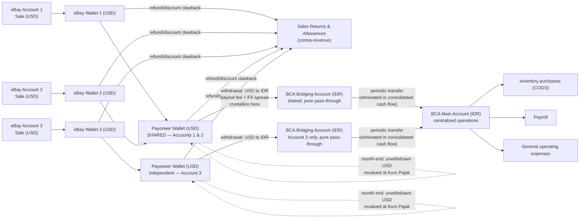
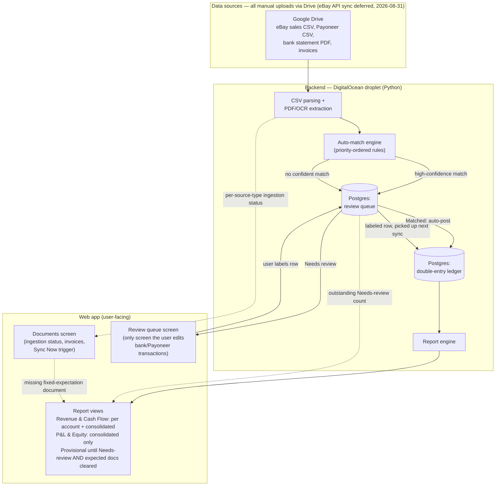

# Flow charts

Two diagrams: how money actually moves through the business, and how the system processes data about that money. See `CLAUDE.md` for the full rules behind both.

## 1. Business money flow

Key points this diagram encodes (see CLAUDE.md for the full rule text):
- **Payoneer wallets are not 1:1 with eBay accounts (clarified 2026-08-31)**: Accounts 1 and 2 share one Payoneer wallet and one downstream BCA bridging account; Account 3 has its own independent pair. Each eBay Wallet stays genuinely per-account regardless.
- Refund/discount clawbacks can happen at **either** the eBay Wallet or the Payoneer stage — both post to Sales Returns & Allowances, never netted into revenue.
- Realized FX gain/loss and the Payoneer payout fee are two separate line items, both crystallizing only at the Payoneer withdrawal step.
- The BCA bridging account has no real operational activity — it's a pass-through. Real spending (COGS, payroll, opex) only happens from the BCA main account.
- The bridging→main transfer nets to zero in consolidated cash flow (intercompany-style elimination) but still shows as a transfer-out in that wallet-group's own cash flow.
- For Accounts 1 and 2, per-account cash flow is only real through the eBay Wallet stage — everything downstream of the shared Payoneer wallet is a pooled figure, not something that can be honestly split per account.

## 2. System data pipeline

Key points this diagram encodes:
- Postgres is the single source of truth — no Sheets API anywhere, and no eBay API calls in this phase either (eBay sales data is a manual CSV upload for now, same as everything else).
- A review-queue row only reaches the ledger two ways: auto-matched with high confidence, or manually labeled by the user in the app. There's no third path (no silent best-guess posting).
- Report views read live from Postgres and carry a Provisional/Final flag driven by **two** things: outstanding review-queue rows, and any missing fixed-expectation source document for that account/period (added 2026-08-31 — a period with zero uploads also has zero review-queue rows, so document presence has to be checked separately, or an empty month would wrongly look "Final").
- Build milestones (see CLAUDE.md) light this diagram up incrementally: milestone 1 is the design pass (no boxes exist yet); milestone 2 builds the ledger box alone (fed by hand-crafted test data, not the real sources shown here); milestone 3 adds the Drive/ingestion/matching/Documents path; milestone 4 adds the web app; milestone 5 adds scheduling (including the Sync Now trigger). eBay API sync, if it happens, replaces the eBay-CSV portion of Drive later, as its own separate future milestone.
